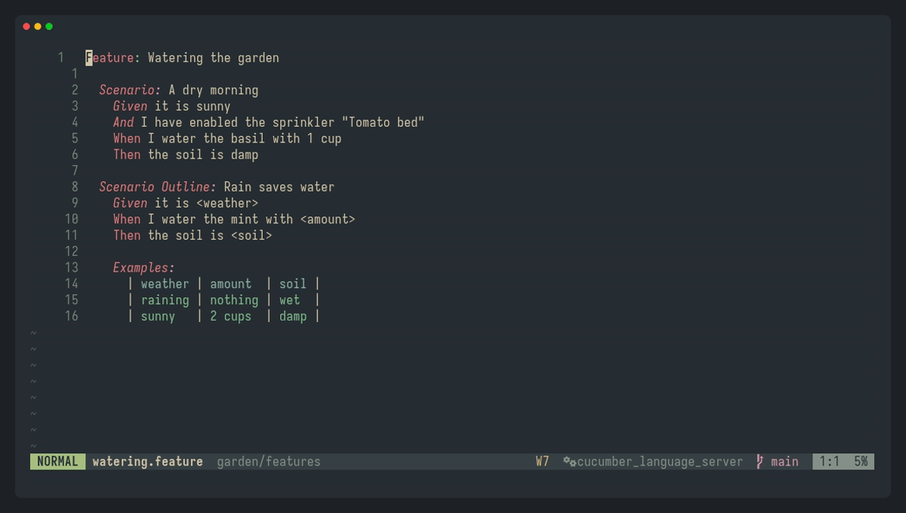

# steplink.nvim

Jump from a Gherkin step in a `.feature` file straight to its pytest-bdd step
definition in a pytest-bdd test suite - and the reverse: from a step definition,
find every scenario that uses it, or scan the whole repo for step definitions no
scenario uses at all.



1. `<leader>ss` on a step in a `.feature` file jumps to its step definition.
2. `<leader>ss` on a step definition lists every scenario that uses it (here in fzf-lua,
   with a preview), including Scenario Outline steps like `I water the mint with <amount>`.
3. `:StepLinkOrphans` lists step definitions no scenario uses.

Try it on the small made-up project in [`demo/`](demo/): `cd demo && nvim garden/features/watering.feature`.

## Why a Python helper

pytest-bdd step definitions often use `pytest_bdd.parsers.re(...)` - real regex, including
named capture groups and alternation - not simple string templates. Matching that
correctly means using Python's own `re` engine and `ast` module rather than
reimplementing PCRE-style regex in Lua.

It also mirrors two things pytest itself does when resolving a step:

- **Ancestor conftest.py scoping**: a step defined in a `conftest.py` is only visible to
  tests in that directory and its subdirectories. Feature files live in a tree that
  mirrors the steps tree, so this plugin mirrors the feature file's directory into the
  steps tree and walks up collecting `conftest.py` files, exactly as pytest would.
- **Cross-tree star-imports**: shared steps in a top-level `core/` directory sit outside
  every BDD project's own directory tree, so each project's root `conftest.py`
  explicitly re-imports those step modules with `from X import *`. This plugin resolves those import chains via `ast` so those
  steps are found too.

Scenario Outline `<placeholder>` tokens are resolved against the step's actual
`Examples:` table before matching, the same substitution pytest-bdd performs at
runtime (the reverse direction checks every row, not just the first, since a false
negative there is worse than the extra cost).

The reverse direction (step -> scenarios) has a harder problem to solve first: given
one Python file, which of the repo's hundreds of feature files could even reach it, before it
can start text-matching. `test_*.py` files resolve precisely via their own
`scenarios(...)` call; `conftest.py`/shared "common" modules resolve by finding every
`conftest.py` in the relevant project(s) whose star-import chain reaches that file, then
mirroring each one's directory back into `features/`.

## Usage

- `:StepLinkGoto` - jump to the step definition under the cursor (also bound to
  `<leader>ss` in `.feature` buffers by default).
- `:StepLinkGotoDebug` - same, but prints the full resolver response.
- `:StepLinkScenarios` - the reverse: find every scenario step that resolves to the
  step definition under the cursor (also bound to the same `<leader>ss`, set only in
  `.py` buffers whose path contains `/steps/` and that sit under a detectable repo
  root - a buffer is always exactly one filetype, so there's no real conflict in
  sharing the key).
- `:StepLinkScenariosDebug` - same, but prints the full resolver response.
- `:StepLinkOrphans` - repo-wide scan for step definitions that no scenario resolves to
  (candidates for dead code), listed in the quickfix window. This is a one-shot audit,
  not a cursor-based lookup, so it isn't bound to any keymap. Treat its output as
  candidates to verify by hand (grep/read the feature files), not as a delete list - a
  false positive here means a bug in the reachability/matching logic, not dead code.
- `:checkhealth steplink` - sanity-checks the Python venv/imports.

## Requirements

- Neovim 0.10+
- Python 3 with `pytest-bdd` importable. The plugin uses the repo's own
  `.venv/bin/python3` when it exists, otherwise `python3` on your `PATH`
  (override with `python_path`).
- Optional: [fzf-lua](https://github.com/ibhagwan/fzf-lua), for a picker with code
  preview when a step matches more than one definition.

## Setup

With Neovim's built-in plugin manager (0.12+):

```lua
vim.pack.add({ "https://github.com/Nozeren/steplink.nvim" })
require("steplink").setup()
```

With [lazy.nvim](https://github.com/folke/lazy.nvim):

```lua
{
  "Nozeren/steplink.nvim",
  config = function() require("steplink").setup() end,
}
```

While working on the plugin, load it straight from your clone instead:

```lua
vim.opt.rtp:prepend("~/dev/steplink.nvim")
require("steplink").setup()
```

## Options

Defaults shown:

```lua
require("steplink").setup({
  python_path = nil,                -- nil = <repo_root>/.venv/bin/python3, else "python3"
  repo_root_markers = { ".git", "pytest.ini" },
  keymap = "<leader>ss",            -- false to disable; used for both directions
  ambiguous_ui = "auto",            -- "auto" (fzf-lua if installed, else "select") | "fzf" | "select" | "quickfix"
  ambiguous_quickfix_threshold = 4, -- only applies to the "select" fallback
  debug = false,
})
```

`:help steplink` has the full reference.
